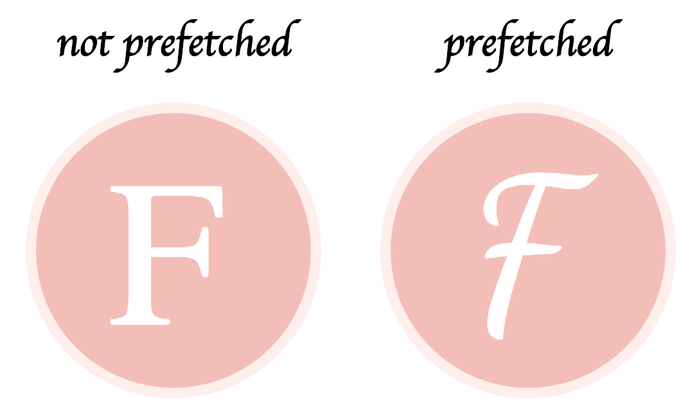

# prefetch-svg

prefetch-svg is a library to prefetch `@import()` and `url()` in the CSS of the SVG. Replacing `import()` with its content and `url()` with a data url. 

## Motivation

SVG can contain CSS that contains `@import()` and `url()`, this leads to bad looking offline SVG. The idea is to prefetch all URLs and assemble them inside the SVG itself. This increase the SVG size but make it usable offline and in `` tags.

## Examples



Live examples:
- Node.js (WIP)
- [CDN](https://repl.it/@ycmjason/prefetch-svg)
- [Module bundler](https://codesandbox.io/s/qv198lvqpq)

## Install

```
npm install --save prefetch-svg
```

Or if you want to use the CLI

```
npm install -g prefetch-svg
```

## Usage

### Node

```js
const prefetchSvg = require('prefetch-svg');
prefetchSvg('<svg>...</svg>').then(prefetchedSvg => { ... });
```

### Browser

You can use a CDN to use this package. (see [example](https://repl.it/@ycmjason/prefetch-svg))

```html
<script src="https://unpkg.com/prefetch-svg/dist/prefetchSvg.umd.js"></script>
<script>
prefetchSvg('<svg>...</svg>').then(prefetchedSvg => { ... });
</script>
```

Or you can use module bundler. (see [example](https://codesandbox.io/s/qv198lvqpq))

```js
import prefetchSvg from "prefetch-svg/dist/prefetchSvg.esm.js";
prefetchSvg('<svg>...</svg>').then(prefetchedSvg => { ... });
```

### CLI

This package also provide a CLI.

```
Usage: prefetch-svg <input> <output>
```


## Author

Jason Yu (me@ycmjason.com)
